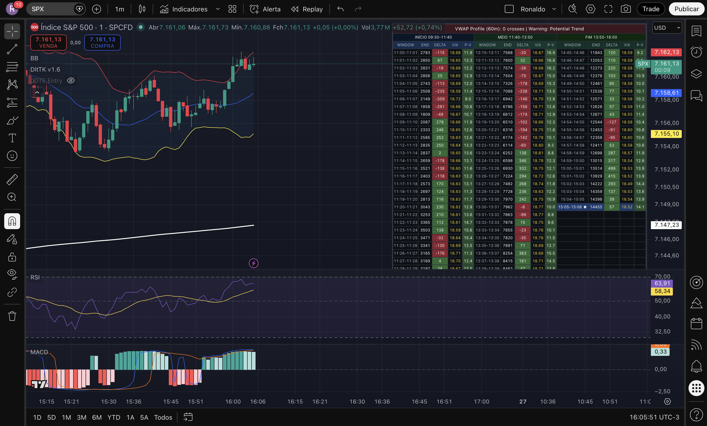

# Trade Journal — Bull Call Spread SPX 0DTE
**Data:** 24 de Abril de 2026 (Sexta-feira)

## Configuração da Operação
| Parâmetro | Valor |
|:---|:---|
| **Tipo** | Debit Spread (Bull Call) |
| **Estrutura** | Long 7135 C / Short 7140 C |
| **Contratos** | 2 |
| **Custo de Entrada** | 1,75 pts ($175/contrato) |
| **Investimento Total** | $350 |
| **Breakeven** | 7136,75 |
| **Lucro Máximo Teórico** | 3,25 pts ($325/contrato) |

## Resultado Final
| Parâmetro | Valor |
|:---|:---|
| **Preço de Saída** | 4,85 pts |
| **Lucro por Contrato** | 3,10 pts ($310) |
| **Lucro Total (2 contratos)** | **$620** |
| **Retorno sobre Risco** | **+177%** |
| **Horário de Saída** | 16:05 (Brasília) |
| **SPX no Momento da Saída** | ~7160 |

## Cronologia do Trade

### 10:30 — Abertura
- SPX abre em **7136,48** (gap de alta pela notícia EUA-Irã)
- Preço atinge rapidamente 7137 (acima do breakeven) mas **rejeita imediatamente**
- Queda para 7122 nos primeiros 30 minutos — Bull Trap de abertura

### 10:54 — Posição Aberta (OTM)
- SPX em **7117,58** — operação estava 17 pontos OTM
- Strikes, breakeven e suporte (7118) marcados no gráfico
- Estrutura valendo ~1,75 (custo de entrada)

### 11:05 — Sinal de Resiliência
- Apesar do SPX em queda, estrutura valendo **1,85** (+5,7%)
- Diagnóstico: expansão de IV (Vega) compensando a perda de Delta
- Decisão do trader: **aguardar até 12h**

### 12:45 — Explosão de Alta
- SPX dispara para **7153** (+28 pontos desde a mínima)
- Notícia de negociações EUA-Irã confirmada pelo mercado
- Estrutura totalmente ITM — valor intrínseco de 5,00
- Ordem de saída colocada a 4,50, depois ajustada para 4,80

### 13:22 — Teste de Paciência
- Estrutura em **4,20** apesar do SPX em 7157
- Diagnóstico: problema de liquidez Deep ITM, não de preço
- Decisão: manter ordem em 4,80

### 15:17 — Convergência do Theta
- Estrutura sobe para **4,50** com SPX estável em 7156
- Theta começa a trabalhar a favor — valor extrínseco evaporando
- Ordem ajustada para **4,90**

### 15:51 — Quase lá
- Estrutura em **4,70**, RSI e MACD confirmando estabilidade
- Projeção de execução entre 16:15-16:30

### 16:03 — Phantom Fill
- Mark price atinge 4,90 mas ordem **não executa**
- Diagnóstico: o Bid real era ~4,80, o Mark mostrado era a média
- Decisão: baixar ordem para **4,85**

### 16:05 — Trade Encerrado ✅
- **Saída executada a 4,85**
- Lucro total: **$620 (+177%)**

## Lições do Trade

1. **Paciência é alpha.** O trader resistiu a múltiplas tentações de saída prematura (1,85 → 4,20 → 4,50) e capturou quase o lucro máximo.
2. **Notícia como catalisador.** A tese direcional estava correta, mas o timing de entrada (pré-abertura) exigiu convicção durante o pullback inicial.
3. **Liquidez Deep ITM é real.** O spread Bid/Ask em opções 0DTE Deep ITM é significativo. Ajustar a ordem 0,05 abaixo do Mark é a diferença entre executar e ficar pendurado.
4. **Theta é aliado no final.** A partir das 15h, o decaimento temporal forçou a convergência do preço da estrutura para o valor intrínseco.

## Evidência Visual (Gráfico no Encerramento)

